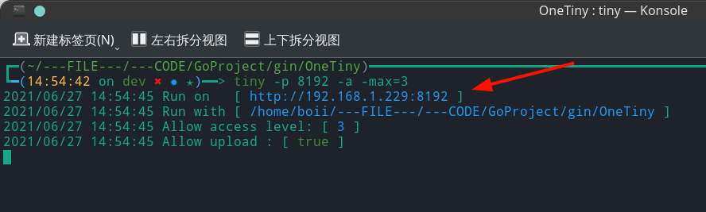
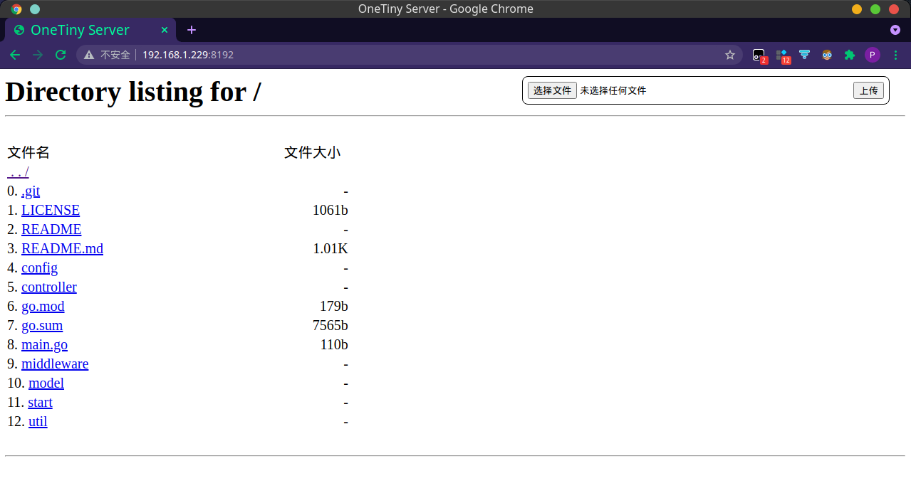

> The documentation was written on 06 June 2021.

<p align="center">
    
</p>
<h1 align="center">OneTiny</h1>
<div align="center">
  <a href="https://www.boii.xyz">
    
  </a>
</div>
<br/>
<div align="center">
  <strong>局域网文件共享工具</strong>
</div>
<br/>

<div align="center">
    <!-- platform -->
    <!--  -->
    
    
    
</div>
<div align="center" >
	<!--version-->
    <a href="" target="blank">
		
    </a>
	<!--license-->
    
    <!--language-->
    <a href="https://golang.org" target="blank">
    	
    </a>
</div>
<hr />


OneTiny 是一个用于局域网内共享文件的微型程序，它能将当前工作目录临时共享目录，对局域网内其他主机共享，通过浏览器访问 `http://局域网IP:9090` 来访问和下载共享目录中的文件。

简而言之与命令 `python -m http.server 9090` 做的是同样的事情。

## [需求]

我有两台设备，一台装着 Linux 系统，一台装着 Windows 系统，偶尔需要互相传输文件。

在 Linux 上我可以在任意一个目录下使用命令 `python -m http.server 9090`，从而在 Windows 上或局域网内其他主机上通过浏览器访问 `http://局域网IP:9090` 查看所有文件，也可以下载;

但是这条命令在 Windows 上不可行，所以需要编写一个程序可以运行在 Windows 上实现同样的功能。

## [开发技术]
- 核心功能：[gin](https://gin-gonic.com/zh-cn/)
- 配置管理：[viper](https://github.com/spf13/viper)
- CLI管理：[urfave/cli](https://github.com/urfave/cli/v2)

## [使用说明]
可从本仓库的 [Release](https://github.com/TCP404/OneTiny/releases/) 中下载对应版本。已提供 [Linux 版](https://github.com/TCP404/OneTiny/releases/download/v0.3.0/OneTiny)、[Windows 版](https://github.com/TCP404/OneTiny/releases/download/v0.3.0/OneTiny.exe)，[Mac 版](https://github.com/TCP404/OneTiny/releases/download/v0.3.0/OneTiny_mac)，其他系统的同学请下载后自行编译。

### [下载]
**Linux**、**Mac**：
```bash
$ curl -LJ https://github.com/TCP404/OneTiny/releases/download/v0.3.0/OneTiny -o onetiny
$ chmod u+x ./onetiny             # 赋予执行权限
$ cp onetiny /usr/bin             # 复制到可执行文件目录并修改可执行文件名称
```

> Mac 用户注意:
> 
> 第一次打开会提示未验证开发者，可以打开 「访达」 ，打开文件所在目录，在 `onetiny` 文件处右键打开。
> 之后就可以直接用命令行运行了。

**Windows**

:point_right: [](https://github.com/TCP404/OneTiny/releases/latest)

点击最新版本的 `OneTiny.exe` 进行下载

> Windows 用户注意：
> 下载时可能会有损害计算机提示，点击 「仍然保留」 即可。


### 安装（其他系统必选，Linux、Windows、MacOS 可选）
**需先安装[Golang](https://golang.org)**
```bash
$ git clone https://github.com/TCP404/OneTiny.git
$ go mod tidy
$ go build
```

### [Command Map]
```
onetiny
├── 不指定时可直接运行，采用默认值
├── --road   -r 指定共享目录路径
├── --port   -p 指定访问端口
├── --allow  -a 指定是否允许上传
├── --max    -x 指定最大访问层级
├── --secure -s 指定是否开启访问登录
│
├── config  「配置命令，用于自定义默认值」
│   ├── --road   -r 设置共享目录路径
│   ├── --port   -p 设置访问端口
│   ├── --allow  -a 设置是否允许上传
│   ├── --max    -x 设置最大访问层级
│   └── --secure -s 设置是否开启访问登录
│
├── update  「更新命令，用于更新版本」
│   ├── 不指定时默认更新到最新版本
│   ├── --list -l 列出所有版本
│   └── --use     更新到指定版本
│
└── sec  「配置用于访问登录时的账号密码」
    ├── --user   -u 设置登录时的帐号
    ├── --pass   -p 设置登录时的密码
    └── --secure -s 设置是否开启访问登录
```

### [运行]
**Windows**: 
下载后双击 `OneTiny.exe` 即可运行（需管理员权限）。
可以在CMD中切换到 `OneTiny.exe` 所在目录，执行以下任一命令：
```cmd
> OneTiny                               # 将运行在 http://本机局域网IP:9090，共享目录为当前工作目录，禁止上传
> OneTiny.exe                           # 将运行在 http://本机局域网IP:9090，共享目录为当前工作目录，禁止上传
> OneTiny -p {端口号}                    # 将运行在 http://本机局域网IP:端口号，共享目录为当前工作目录，禁止上传
> OneTiny -r {共享目录绝对路径}            # 将运行在 http://本机局域网IP:9090，共享目录为指定目录，禁止上传
> OneTiny -a [1|t|T|true|True|TRUE|空]  # 将运行在 http://本机局域网IP:9090，共享目录为当前工作目录，允许上传
> OneTiny -x {0～255}                   # 将运行在 http://本机局域网IP:9090，共享目录为当前工作目录，禁止上传，默认仅允许访问共享目录一层，禁止进入下一层目录
> onetiny -s [1|t|T|true|True|TRUE|空]  # 开启后访问时需登录帐号密码

配置命令，配置后仅使用 onetiny 命令运行，即可使用配置好的端口、路径、层级、上传允许状态等，无需再次指定
> onetiny c -p {端口号}                       # 将运行在 http://本机局域网IP:端口号，共享目录为当前工作目录，禁止上传
> onetiny cf -r {共享目录绝对路径}              # 将运行在 http://本机局域网IP:9090，共享目录为指定工作目录，禁止上传
> onetiny conf -a [1|t|T|true|True|TRUE|空]  # 将运行在 http://本机局域网IP:9090，共享目录为当前工作目录，允许上传
> onetiny config -x {0~255}                  # 将运行在 http://本机局域网IP:9090，共享目录为当前工作目录，禁止上传，默认仅允许访问共享目录一层，禁止进入下一层目录
> onetiny -s [1|t|T|true|True|TRUE|空]       # 配置后访问时需登录帐号密码

开启访问登录，需先设置账号密码
> onetiny s -u boii -p=123      # 设置帐号名为 boii，密码为 123
> onetiny sec -s                # 设置开启访问登录
> onetiny sec -u=http403        # 重设帐号名为 http403
> onetiny s -p 1234             # 重设密码为 1234
> onetiny sec                   # 查看当前访问登录状态

更新命令
> onetiny u             # 更新到最新版本
> onetiny up            # 更新到最新版本
> onetiny update        # 更新到最新版本
> onetiny update -l     # 列出所有版本
> onetiny updata --use  # 更新到指定版本

> onetiny -h       # 打印帮助信息
> onetiny --help
> onetiny -v       # 打印版本信息
> onetiny --version

> OneTiny -r=C:\Users\Boii -p=8192 -a -x=2      # 将运行在 「http://本机局域网IP:8192」，共享目录为 「C:\Users\Boii」 ，允许上传，允许访问共享目录往下2层
```

**Linux**、**Mac**:
```bash
$ onetiny                              # 将运行在 http://本机局域网IP:9090，共享目录为当前工作目录，禁止上传
$ onetiny -p {端口号}                   # 将运行在 http://本机局域网IP:端口号，共享目录为当前工作目录，禁止上传
$ onetiny -r {共享目录绝对路径}           # 将运行在 http://本机局域网IP:9090，共享目录为指定工作目录，禁止上传
$ onetiny -a [1|t|T|true|True|TRUE|空] # 将运行在 http://本机局域网IP:9090，共享目录为当前工作目录，允许上传
$ onetiny -x {0~255}                   # 将运行在 http://本机局域网IP:9090，共享目录为当前工作目录，禁止上传，默认仅允许访问共享目录一层，禁止进入下一层目录
$ onetiny -s [1|t|T|true|True|TRUE|空] # 开启后访问时需登录帐号密码

配置命令，配置后仅使用 onetiny 命令运行，即可使用配置好的端口、路径、层级、上传允许状态等
$ onetiny c -p {端口号}                       # 将运行在 http://本机局域网IP:端口号，共享目录为当前工作目录，禁止上传
$ onetiny cf -r {共享目录绝对路径}              # 将运行在 http://本机局域网IP:9090，共享目录为指定工作目录，禁止上传
$ onetiny conf -a [1|t|T|true|True|TRUE|空]  # 将运行在 http://本机局域网IP:9090，共享目录为当前工作目录，允许上传
$ onetiny config -x {0~255}                  # 将运行在 http://本机局域网IP:9090，共享目录为当前工作目录，禁止上传，默认仅允许访问共享目录一层，禁止进入下一层目录
$ onetiny -s [1|t|T|true|True|TRUE|空]       # 配置后访问时需登录帐号密码

开启访问登录，需先设置账号密码
$ onetiny s -u boii -p=123      # 设置帐号为 boii，密码为 123
$ onetiny sec -s                # 设置开启访问登录
$ onetiny sec                   # 查看当前访问登录状态

更新命令
$ onetiny u             # 更新到最新版本
$ onetiny up            # 更新到最新版本
$ onetiny update        # 更新到最新版本
$ onetiny update -l     # 列出所有版本
$ onetiny updata --use  # 更新到指定版本

$ onetiny -h       # 打印帮助信息
$ onetiny --help
$ onetiny -v       # 打印版本信息
$ onetiny --version

$ onetiny -r=/home/boii -p=8192 -a -x=2      # 将运行在 「http://本机局域网IP:8192」，共享目录为 「/home/boii」，允许上传，允许访问共享目录往下2层
```


**更多信息**:

全局命令：
```bash
$ onetiny -h
NAME:
   OneTiny - 一个用于局域网内共享文件的FTP程序

USAGE:
   onetiny [GLOBAL OPTIONS] COMMAND [COMMAND OPTIONS] [参数...]

VERSION:
   v0.3.0

AUTHOR:
   Boii <i@tcp404.com>

COMMANDS:
   update, u, up             更新 OneTiny 到最新版
   config, c, cf, cfg, conf  设置默认配置
   sec, s                    设置访问登录的账户和密码
   help, h                   Shows a list of commands or help for one command

GLOBAL OPTIONS:
   --road    路径, -r 路径   指定对外开放的目录路径 (default: /home/boii)
   --port    端口, -p 端口   指定开放的端口 (default: 9110)
   --allow   是否, -a 是否   指定是否允许访问者上传 (default: true)
   --max     深度, -x 深度   指定允许访问的深度，默认仅限访问共享目录 (default: 0)
   --secure  开启, -s 开启   指定是否开启访问登录 (default: true)
   --help,        -h        打印帮助信息 (default: false)
   --version,     -v        打印版本信息 (default: false)
```

config 子命令:
```bash
$ onetiny c -h
NAME:
   onetiny config - 设置默认配置

USAGE:
   onetiny config [OPTIONS]

DESCRIPTION:
    使用 onetiny config 命令可以将设置写入配置文件。
    使用方式与 onetiny 命令相同，仅多了一个 config 关键字，如：
      onetiny config -p 10240  可以将端口设置为 10240 写入配置
      onetiny config -a false  可以设置不允许访问者上传并写入配置

OPTIONS:
   --road   路径, -r 路径   指定对外开放的目录路径 (default: /)
   --port   端口, -p 端口   指定开放的端口 (default: 9090)
   --allow  是否, -a 是否   指定是否允许访问者上传 (default: false)
   --max    深度, -x 深度   指定允许访问的深度，默认仅限访问共享目录 (default: 0)
   --secure 开启, -s 开启   指定是否开启访问登录 (default: false)
   --help,        -h       打印帮助信息 (default: false)
```

secure 子命令:
```bash
$ onetiny s -h
NAME:
   tiny sec - 设置访问登录的账户和密码

USAGE:
   onetiny sec [OPTIONS]

DESCRIPTION:
    使用 onetiny sec 命令可以设置访问登录的帐号密码。
    允许的命令形式如下：
      注册并开启：    onetiny sec -u=账户名 -p=密码 -s
      注册/覆盖账户： onetiny sec -u=账户名 -p=密码
      重设密码：     onetiny sec -p=密码

OPTIONS:
   --user   账户, -u 账户  设置访问登录的账户名
   --pass   密码, -p 密码  设置访问登录的密码
   --secure 开启, -s 开启  设置开启访问登录，效果同 onetiny -s 一样 (default: false)
   --help,        -h      打印帮助信息 (default: false)
```

update 子命令:
```bash
NAME:
   onetiny update - 更新 OneTiny 到最新版

USAGE:
   onetiny update [command options] [arguments...]

OPTIONS:
   --list, -l   列出远程服务器上所有可用版本 (default: false)
   --use value  指定版本号
   --help, -h   打印帮助信息 (default: false)
```

### [访问]
1. 运行程序后，程序会提示此次服务运行在哪个端口，共享的是哪个目录，是否允许上传，允许访问的最大深度。
2. 打开浏览器，输入程序提示框中给出的地址，回车即可访问。

举个栗子：

红色箭头所指即为服务运行地址。

打开浏览器输入程序给出的地址，即可访问共享目录中的文件：



**点击文件链接即可下载。**

### [结束运行]
**Linux**：
命令行中使用快捷键 `Ctrl + C` 即可停止程序运行。

**Windows**：
关闭cmd命令框即可。

> 注意：
> 1. 在 Linux 或 Mac 系统下，需要将可执行文件移动至 `/usr/bin` 下：
>     ```bash
>     mv ./OneTiny /usr/bin/tiny
>     ```
>     才能像内置命令一样使用。可以改成你喜欢的名字。
> 2. Windows 下载时可能会有损害计算机提示，点击仍然保留即可。

## [TODO]
- [x] 上传功能
- [x] 限定访问层级
- [x] 密码验证功能（防止局域网内监听）
- [ ] 断点续传
- [ ] 大文件多线程下载
- [ ] 自动检查更新功能
- [ ] 增加图形界面（使用 [fyne](https://fyne.io/)）

## [鸣谢]
- [gin](https://gin-gonic.com/zh-cn/)
- [viper](https://github.com/spf13/viper)
- [urfave/cli](https://github.com/urfave/cli/v2)
- [fatih/color](https://github.com/fatih/color)
- [schollz/progressbar](https://github.com/schollz/progressbar/v3)
- [gin-contrib/sessions](https://github.com/gin-contrib/sessions)