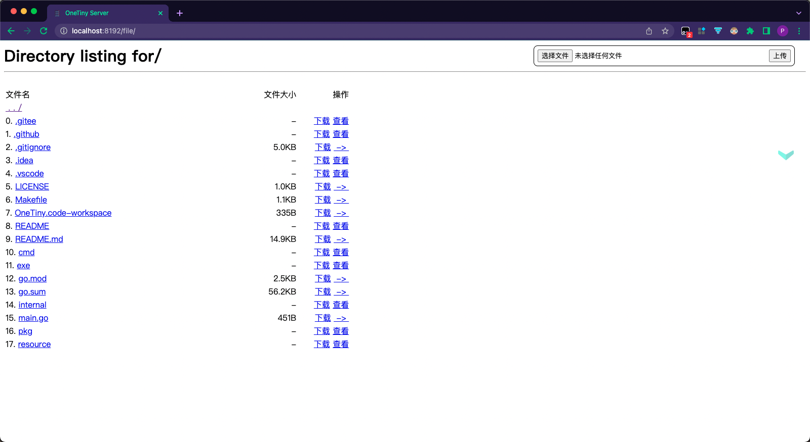

> The documentation was written on 06 June 2021.

<p align="center">
    
</p>
<h1 align="center">OneTiny</h1>
<div align="center">
  <a href="https://www.boii.xyz">
    
  </a>
</div>
<br/>
<div align="center">
  <strong>局域网文件共享工具</strong>
</div>
<br/>

<div align="center">
    <!-- platform -->
    <!--  -->
    
    
    
</div>
<div align="center" >
	<!--version-->
    <a href="" target="blank">
		
    </a>
	<!--license-->
    
    <!--language-->
    <a href="https://golang.org" target="blank">
    	
    </a>
</div>
<hr />


OneTiny 是一个用于局域网内共享文件的微型程序，它能将当前工作目录临时共享目录，对局域网内其他主机共享，通过浏览器访问 `http://局域网IP:9090` 来访问和下载共享目录中的文件。

简而言之与命令 `python -m http.server 9090` 做的是同样的事情。

## 需求

我有两台设备，一台装着 Linux 系统，一台装着 Windows 系统，偶尔需要互相传输文件。

在 Linux 上我可以在任意一个目录下使用命令 `python -m http.server 9090`，从而在 Windows 上或局域网内其他主机上通过浏览器访问 `http://局域网IP:9090` 查看所有文件，也可以下载;

但是这条命令在 Windows 上不可行，所以需要编写一个程序可以运行在 Windows 上实现同样的功能。

## 开发技术
最近在学 [Golang](https://golang.org) 和 [gin](https://gin-gonic.com/zh-cn/) 框架，且 Golang 可以编译出不依赖于虚拟机的独立的可执行文件，也可以交叉编译，所以采用了 gin 做一个简单的局域网微型服务器。

## 使用说明
可从本仓库的 [Release](https://github.com/TCP404/OneTiny/releases/) 中下载对应版本。已提供 [Linux 版](https://github.com/TCP404/OneTiny/releases/download/v0.2.2/OneTiny)、[Windows 版](https://github.com/TCP404/OneTiny/releases/download/v0.2.2/OneTiny.exe)，[Mac 版](https://github.com/TCP404/OneTiny/releases/download/v0.2.2/OneTiny_mac)，其他系统的同学请下载后自行编译。

### 下载
**Linux**
```bash
$ curl -LJO https://github.com/TCP404/OneTiny/releases/download/v0.2.2/OneTiny
$ chmod u+x ./OneTiny
$ sudo cp OneTiny /usr/bin
```

**Windows**

:point_right: [](https://github.com/TCP404/OneTiny/releases/latest)

点击最新版本的 `OneTiny.exe` 进行下载

**Mac**

```bash
% curl -LJO https://github.com/TCP404/OneTiny/releases/download/v0.2.2/OneTiny
% chmod u+x OneTiny_mac             # 赋予执行权限
% mv OneTiny_mac /usr/bin/OneTiny   # 移动到可执行文件目录并修改可执行文件名称
```
第一次打开会提示未验证开发者，可以打开“访达”，打开文件所在目录，在 `OneTiny` 文件处右键打开。

之后就可以直接用命令行运行了。


### 安装（其他系统必选，Linux、Windows、MacOS 可选）
**需先安装[Golang](https://golang.org)**
```bash
$ git clone https://github.com/TCP404/OneTiny.git
$ go mod tidy
$ go build
```

### 运行
**Windows**: 
下载后双击 `OneTiny.exe` 即可运行（需管理员权限）。
可以在CMD中切换到 `OneTiny.exe` 所在目录，执行以下任一命令：
```cmd
> OneTiny                               # 将运行在 http://本机局域网IP:9090，共享目录为当前工作目录，不允许上传
> OneTiny.exe                           # 将运行在 http://本机局域网IP:9090，共享目录为当前工作目录，不允许上传
> OneTiny -p {指定端口}                  # 将运行在 http://本机局域网IP:指定端口，共享目录为当前工作目录，不允许上传
> OneTiny -r {指定目录}                  # 将运行在 http://本机局域网IP:9090，共享目录为指定目录，不允许上传
> OneTiny -a [1|t|T|true|True|TRUE|空]  # 将运行在 http://本机局域网IP:9090，共享目录为当前工作目录，允许上传
> OneTiny -r {指定目录} -p {指定端口} -a  # 将运行在 http://本机局域网IP:指定端口，共享目录为指定目录，允许上传
> OneTiny -h                           # 打印帮助信息
```

**Linux**: 
```bash
$ OneTiny                              # 将运行在 http://本机局域网IP:9090，共享目录为当前工作目录，不允许上传
$ OneTiny -p {指定端口}                 # 将运行在 http://本机局域网IP:指定端口，共享目录为当前工作目录，不允许上传
$ OneTiny -r {指定目录}                 # 将运行在 http://本机局域网IP:9090，共享目录为指定目录，不允许上传
$ OneTiny -a [1|t|T|true|True|TRUE|空] # 将运行在 http://本机局域网IP:9090，共享目录为当前工作目录，允许上传
$ OneTiny -r {指定目录} -p {指定端口}    # 将运行在 http://本机局域网IP:指定端口，共享目录为指定目录
$ OneTiny -h                          # 打印帮助信息
```

**Mac**:
```bash
$ OneTiny                              # 将运行在 http://本机局域网IP:9090，共享目录为当前工作目录，不允许上传
$ OneTiny -p {指定端口}                 # 将运行在 http://本机局域网IP:指定端口，共享目录为当前工作目录，不允许上传
$ OneTiny -r {指定目录}                 # 将运行在 http://本机局域网IP:9090，共享目录为指定目录，不允许上传
$ OneTiny -a [1|t|T|true|True|TRUE|空] # 将运行在 http://本机局域网IP:9090，共享目录为当前工作目录，允许上传
$ OneTiny -r {指定目录} -p {指定端口}    # 将运行在 http://本机局域网IP:指定端口，共享目录为指定目录
$ OneTiny -h                          # 打印帮助信息
```

### 访问
1. 运行程序后，程序会提示此次服务运行在哪个端口，共享的是哪个目录。
2. 打开浏览器，输入程序提示框中给出的地址，回车即可访问。

举个栗子：

红色箭头所指即为服务运行地址。

打开浏览器输入程序给出的地址，即可访问共享目录中的文件：



**点击文件链接即可下载。**

### 结束运行
**Linux**：
命令行中使用快捷键 `Ctrl + C` 即可停止程序运行。

**Windows**：
关闭cmd命令框即可。

> 注意：
> 1. 在 Linux 或 Mac 系统下，需要将可执行文件移动至 `/usr/bin` 下：
>     ```bash
>     mv ./OneTiny /usr/bin/tiny
>     ```
>     才能像内置命令一样使用。可以改成你喜欢的名字。
> 2. Windows 下载时可能会有损害计算机提示，点击仍然保留即可。


## 程序说明

首先获得一个 gin 实例，注册一个404路由处理 [404 错误](https://en.wikipedia.org/wiki/HTTP_404)

然后再注册一个普通路由，使用通配符以便读取所有链接。

因为是局域网内，且主要是我自己两台设备之间互传文件，所以就使用简单的 GET 请求。（此处可改进）。

浏览器访问 `http://本机局域网IP:指定端口号` 时，将当前工作目录视为根目录，以链接形式展示根目录下所有文件及子目录;

点击链接将重新发起新的请求，解析请求中的路径，判断是否为目录;

- 是 -> 读取目录下所有文件及子目录，生成链接，返回给客户端
- 否 -> 调用下载函数，将文件内容返回给客户端完成下载。

```go
func main() {
	gin.SetMode(gin.ReleaseMode)

	r := gin.Default()
	r.NoRoute(controller.NotFound)
	r.GET("/*filename", controller.Handler)

	r.Run(":" + controller.Port)
}
```


## TODO
- [x] 上传功能
- [ ] 密码验证功能（防止局域网内监听）
- [ ] 增加图形界面（使用 [fyne](https://fyne.io/))
